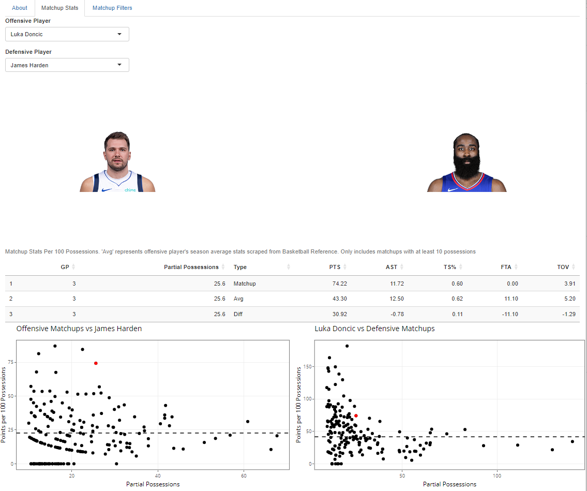

# NBA Matchups

Utilizing NBA API data from Saiem Gilani's hoopR package, I created a shiny app that lets you analyze player matchups during the 2023-2024 NBA season. The app shows each offensive player's stats per 100 possessions during these matchups, along with how many 'partial possesions' they were guarded by the defender. 'Partial possessions' is defined by the NBA as 'the sum total of partial possessions that were spent defending that player.' My app has 3 main analyses. First, in the 'Matchup Stats' tab, you can select your offensive and defensive player matchup, and a table will be produced, which shows the matchup stats, the offensive player's average stats this season, and the difference between the two. Underneath the table, there will be 2 scatterplots: one showing all of the offensive player's defensive matchups this season and vice versa (the plot shows total partial possessions and points per 100 possesions). These tools together can help us understand how a player has guarded/attacked a certain matchup. Finally, the 'Matchup Filters' tab shows the average points per 100 possessions of every matchup for a certain defender, along with the weighted average of their matchups' average scoring. To illustrate how the app can be used, consider the Clippers Mavericks upcoming playoff matchup. The Clippers may be debating who should be primarily guarding Luka, and should they be prioritize keeping a certain defensive matchup on him. For illustration purposes, I've picked James Harden and Kawhi Leonard. As you can see in the screenshots below, Kawhi had limited success against Luka (allowing over 40 points per 100 possessions but only 50% TS%), but he defended much better than Harden this season. While these statistics are presented without context, it gives some hint as to who the better matchup could be, and conversely, who Luka may want to attack. 

# Built with:

-   hoopR
-   R Shiny

# Screenshot:

[{width="3000"}](https://ymelamed.shinyapps.io/matchup/)
[{width="3000"}](https://ymelamed.shinyapps.io/matchup/)
